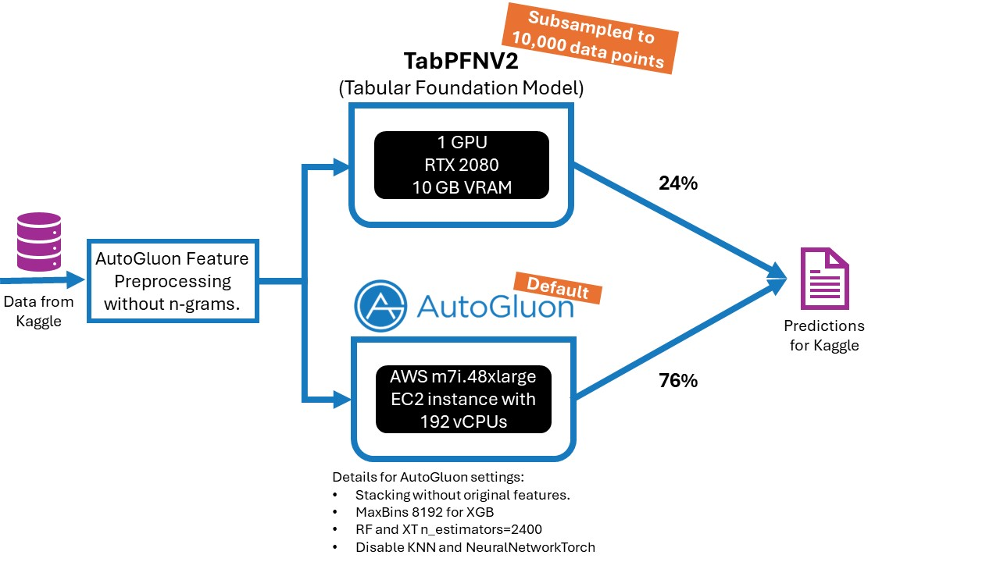

# [Team AutoML Grandmasters] Fifth AutoML Grand Prix Competition Write-Up

See [here](TODO) for the detailed post-competition write-up.

This repository additionally provides the used code to run AutoGluon with the same settings as we did (`run_autogluon.py`) and to run TabPFNV2 (`run_tabpfn_v2.py`), the required requirements (`requirements.txt`), and
an additional overview picture (`overview.jpg`).

## Reproducing Our Submission
<!---
A link to a code repository with complete and detailed instructions so that the results obtained can be reproduced. This is recommended for all participants and mandatory for winners to claim the prizes.
-->

To reproduce (not replicate as this is essentially impossible given different hardware and time-based randomness) our submission, follow these steps:
* Install the required python packages specified in `requirements.txt`. 
* Download the test and train data from Kaggle.
* Run `run_autogluon.py` and `run_tabpfn_v2.py`
* Ensemble the output of both models. We used 0.76 for AutoGluon and 0.24 for TabPFNV2. However, other weights might work better for you. 

## Main Contributions List
<!--- An itemized list of your main contributions and critical elements of success. Suggestions: Contrast your proposed method with others e.g. in terms of computational or implementation complexity, parallelism, memory cost, theoretical grounding.
-->
* AutoGluon Mainline with minor changes to the default settings.
* Using the tabular foundation model TabPFNV2.

## Detailed Methodology
<!--- A detailed description of methodology. Expand and explain your contributions in more detail. The explanations must be self-contained and one must be able to reproduce the approach by reading this section. You can explain and justify the approach by any means, e.g. citations, equations, tables, algorithms, platforms and code libraries utilized, etc. A detailed explanation of the architecture, preprocessing, loss function, training details, hyper-parameters, etc. is expected.
-->
See [here](TODO) for more details.

## Workflow Diagram
<!--- A representative image / workflow diagram of the method to support additional description. -->

